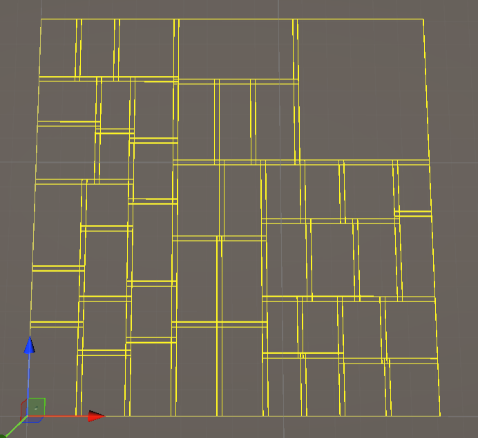
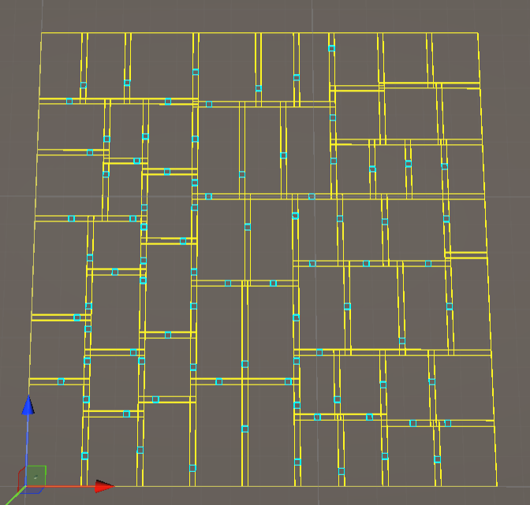
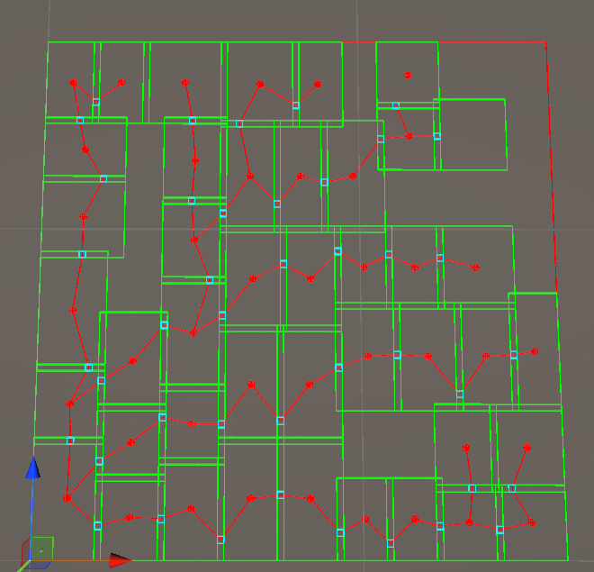
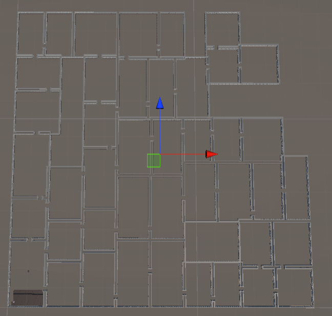
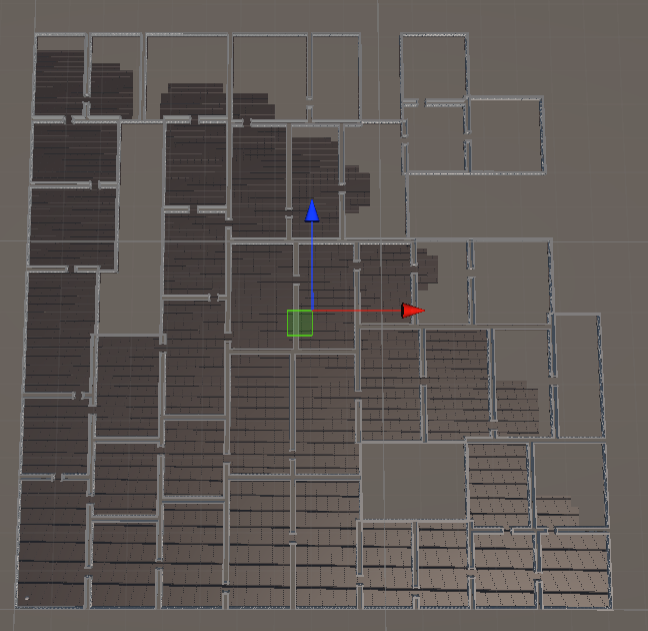

# Dungeon Generator in Unity 

A fully procedural dungeon generator built in Unity.
It uses Binary Space Partitioning (BSP), room graph‑based connectivity, tilemap generation, wall and floor spawning, and optional Dijkstra pathfinding.

## Preview

## Dungeon Generation Stages

| Stage | Description | Preview |
|-------|-------------|---------|
| **1. Room Splitting (BSP)** | The dungeon starts as one large rectangle and is recursively split horizontally and vertically.  |  |
| **2. Door Spawning** | Intersecting rooms generate door rectangles that ensure connectivity. |  |
| **3. Making the rooms to not loop + 25% Room Deletion** | A graph is built using rooms and doors as nodes. Edges represent valid connections. The graph is converted into a tree to remove loops.A percentage of small rooms is removed while keeping the graph connected. | |
| **4. Wall Construction (Marching Squares)** | A 2D tilemap is created from rooms and doors. After that, walls are placed using the created tilemap and the marching‑squares logic. |  |
| **5. Floor Filling (BFS)** | A BFS flood fill creates the walkable floor tiles and optionally builds nodes for Dijkstra pathfinding. |  |
| **6. The dungeon is built, and the player can move** | The player can move in the dungeon |  |

## Features
### Dungeon Generation
* Recursive horizontal/vertical room splitting (BSP)

* Automatic door placement based on room intersections

* Optional removal of small rooms while preserving graph connectivity

* Graph‑based structure for rooms and doors

* Ability to convert the graph into a loop‑free tree

### Tilemap & Wall Generation
* Marching‑squares‑style wall placement

* Tilemap visualisation

* Efficient coroutine‑based wall spawning

* ScriptableObject‑based wall variants

### Floor Filling
* BFS‑based flood fill to generate walkable floor tiles

* Optional graph node creation for Dijkstra pathfinding

* Door‑aware diagonal movement restrictions

### Pathfinding (Optional)
* Dijkstra pathfinding using a custom graph

* Automatic node/edge creation during floor fill

* Player movement along calculated paths

### Player & Camera
* Click‑to‑move player controller

* NavMeshAgent movement (when Dijkstra is disabled)

## Controls
* Left Click — Move the player

* S — Switch to instant generation

* Space — Skip current step (step‑by‑step mode)

## Requirements
* Unity 6000.3.9f1 or newer

## Installation
* Clone the repository

* Open the project in Unity

* In the project window inside Unity, open the Assets/Scenes folder

* Open the ProceduralDungeonScene.unity 

* Press Play

* Watch the dungeon generate itself in Scene view
## Known issues

* Dijsktra pathfinding

## Future Improvements

* Fixing the Dijkstra pathfinding

* Implement A* pathfinding

* Combine this project with my other dungeon project: https://github.com/hristodinkov/Dungeon_design_patterns

